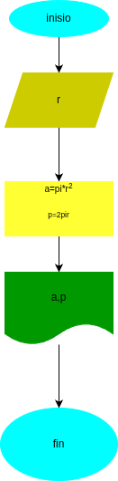

# Programa 1: area_perimetro_circulo
programa en python para calcular el area y el perimetr de un cirulo,dado el valor de su radio

  ## Análisis

### variable de entada 
- r: radio del circulo 

### Procesamiento 
- a: area del circulo
- p:perimetro del circulo 

a = pi*r*r
p = 2*pi*r

  ## Diseño

  ## Construccion
